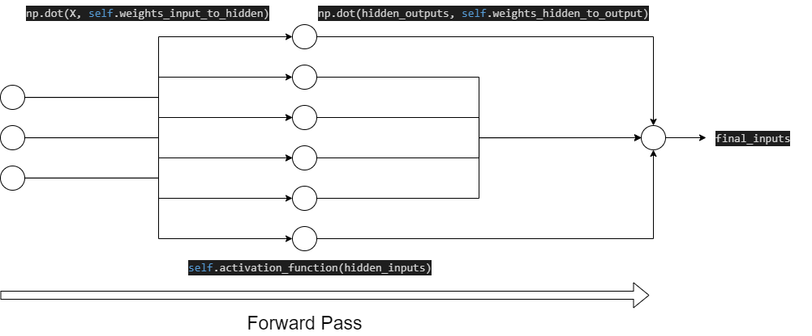
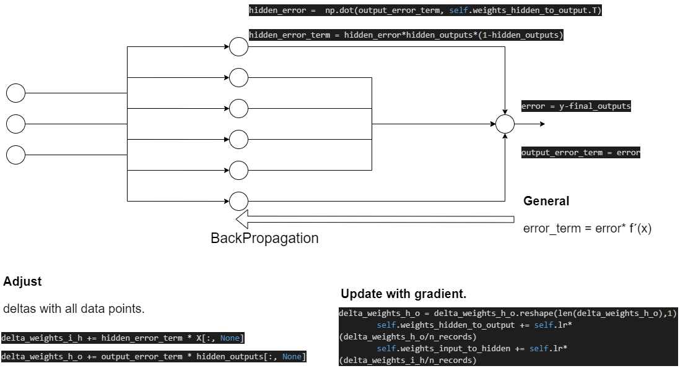
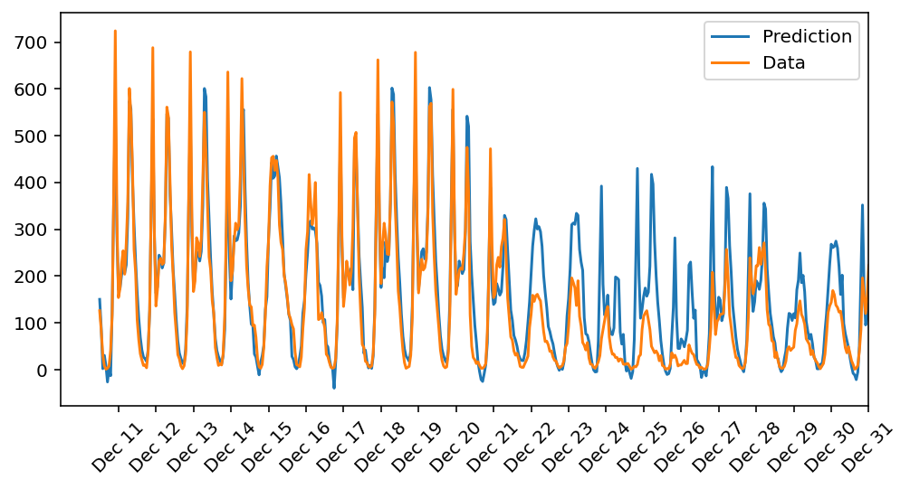

# Biker-sharing Deep Learning Nanodegree
+ This is the first project on Udacity Nano degree on Deeplearning.
+ While doing the required work, I will also keep testing my own ideas. I am particularly interested in creating benchmarks for the way I tackle problems. In this particular instance, I wanted to see how feasible is to modify the network architecture along with other hyperparameters.
+ [todo]: Compare against XGBOOST. Apply Shap values for feaure importance.
+ Check the notebook Predicting_bike_sharing_data.ipynb for the experiments.
+ Check my_answers.py for the actual implementation of gradient descent
+ *Keywords*: Deep Learning, Gradient descent, feedforward neural network, Bayesian search, ANOVA, Mutual Information.

## Features
Dataset from [1].
+ season: Dummy. 4 values.
+ yr: integer. 2 values.
+ mnth: Dummy. 12 values.
+ hr: Dummy. 24 values.
+ holiday: Integer. 2 values.
+ weekday: Dummy. 6 values.
+ weathersit. Dummy. 4 values.
+ temp. Positive number.
+ hum. Positive number.
+ windspeed. Positve number. (0,1]
+ Targer: cnt. Total use of bikes per hour.

## Dataset.
+ 59 Columns. January 1 2011- December 31 2012
+ 21 last day for testing.
+ 60 last day of training set as validation. Prior test set cut off.
+ Normalized features: ['casual', 'registered', 'cnt', 'temp', 'hum', 'windspeed']

## How did I closed the search space.
+ Create selector of features. We will leverage sklearn **SelectKBest**. For continuous features we will apply **ANOVA/f_regression** to select k top features (Rank by p-value). For discrete features we will use mutual information (**mutual_info_regression**). The ANOVA would pick linear relationships between features and target. It assumes normality. Mutual information does not make any assumptions. It try to quantify the amount of information a pair of random variable shares. 
    +   According to the search, all features helped the NN. Holiday was the less important.
+ Apply Bayesian search of hyperparameters with **Hyperopt**. With Bayesian search we try to swap the optimization space more efficiently by taking into account the history of trials. In the current exercise, the optimization space contains, hyperparameters as learning rate,  feature selection steps, and network architecture (selection of number of hiddens units).
+ I also try to apply early stopping with a naive implementation.
    +   Helped to narrow down unstable configuratios. Once a stable band is found, early stopping was removed.

## How well does the model predict the data? Where does it fail? Why does it fail where it does

+ It fails to predict later December data, probably because some seasonality not well capture by last year data. Seasonal components of a time series problem require more data from previous years.
+ As in any time series problems, the further in time from training time span the predictions are made, the less accurate they become. I don’t think more optimizations can solve this problem, we simply need more data or maybe an independent model for seasonal effects.

## Forward pass diagram

## BackPropagation diagram

## Final predictions
+ Training loss **0.073**. Validation loss: **0.187**

## Final Architecure
+ iterations = 12500
+ learning_rate = 0.15975162730953352
+ hidden_nodes = 10
+ output_nodes = 1

## bibliography

+ [1] https://archive.ics.uci.edu/ml/datasets/Bike+Sharing+Dataset
+ [2] http://hyperopt.github.io/hyperopt/
+ [3] https://scikit-learn.org/stable/